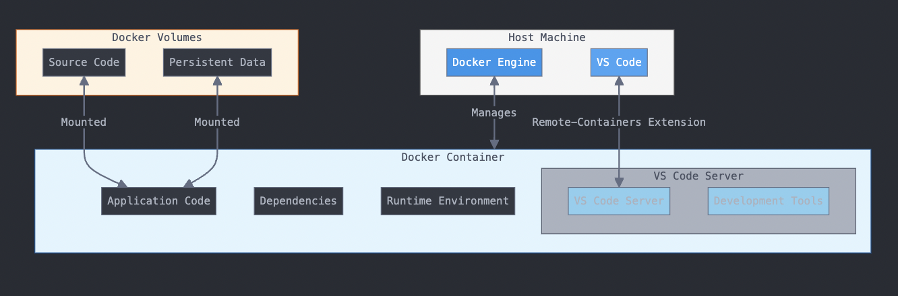
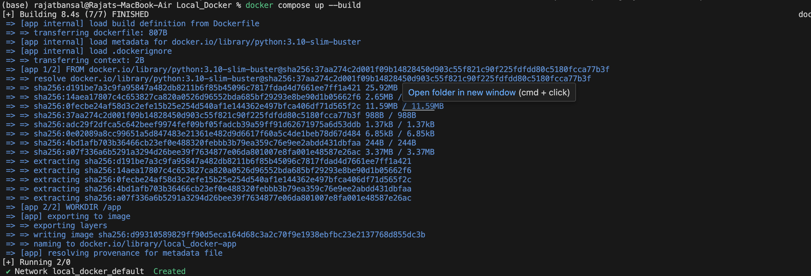
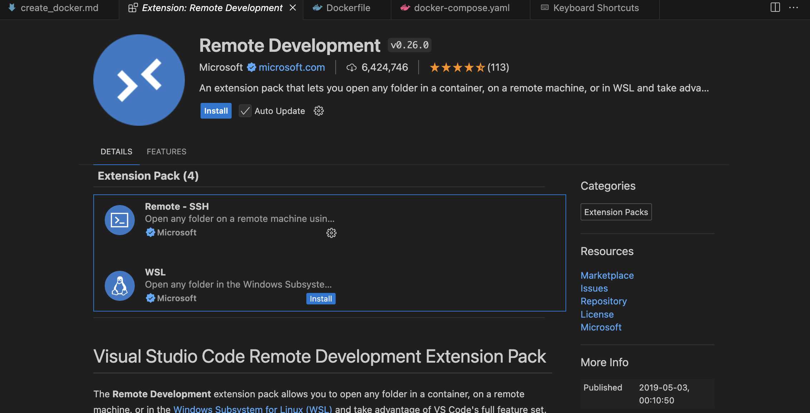
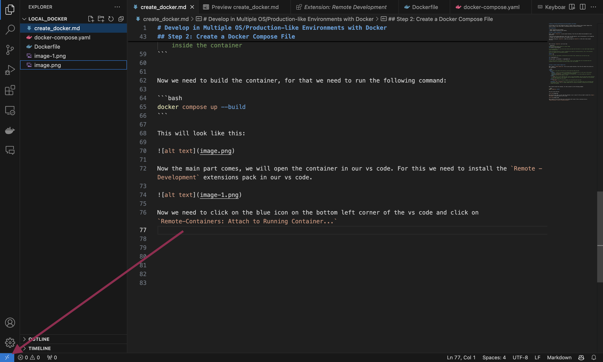
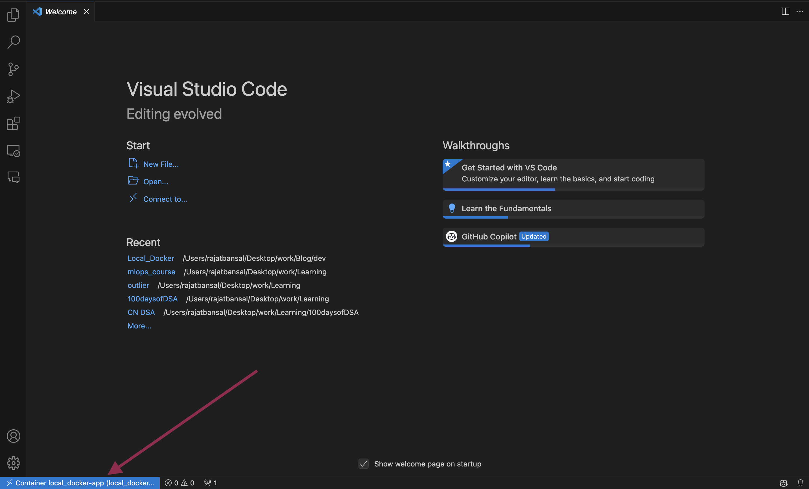

# Develop in Multiple OS/Production-like Environments with Docker

In this guide, we will walk through the steps to create a Docker container using a Docker Compose file, attach a volume to your code folder, and develop directly inside the container.



## Prerequisites

- Docker installed on your machine
- Docker Compose installed on your machine

## Step 1: Create a Dockerfile

First, create a `Dockerfile` in your project directory. This file will define the environment for your application.

I will work with a Python application that I will run with Gunicorn. As you know, Gunicorn is not supported on Windows, but using Docker, you can run it on Windows as well.

Let's start writing our `Dockerfile`. Make sure you keep the `Dockerfile` in the root of your project directory.

This is how our `Dockerfile` will look like:

```Dockerfile
# Use an official Python runtime as a parent image
FROM python:3.10-slim-buster

# I am using python 3.10, you can use any version you want and slim buster is a very light weight image with least vulnerabilities

# Set the working directory to /app, in Dockerfile we specify a working directory, this is the directory where the command will be executed by default

WORKDIR /app

# If you have any requirements, add them here and install them, otherwise you can skip this step

COPY requirements.txt ./

RUN pip install --no-cache-dir -r requirements.txt

# now we shall give a entrypoint to our container, this is the command that will be executed when the container starts or we can give this when we shall start the container

```

## Step 2: Create a Docker Compose File

Next, create a `docker-compose.yml` file in your project directory. This file will define the services for your application.

```yaml
services:
  app: # this is the name of the service, you can give any name you want
    build: 
      context: . # this is the path to the Dockerfile, if the Dockerfile is in the root of the project directory, you can use `.` to specify the current directory
      dockerfile: Dockerfile # this is the name of the Dockerfile, if you have named your Dockerfile something else, you can specify it here
    volumes:
      - .:/app # this is most important part, this is the volume mapping, this will map the current directory to the /app directory in the container and the changes you will do inside container will be reflected in the host machine and vice versa
    ports:
      - "8000:8000" # this is the port mapping, you can map any port you want

    entrypoint: tail -f /dev/null # this is the entrypoint, this is the command that will be executed when the container starts, this is a dummy command that will keep the container running and we can develop inside the container
```


Now we need to build the container, for that we need to run the following command:

```bash
docker compose up --build
```

This will look like this:



Now the main part comes, we will open the container in our vs code. For this we need to install the `Remote - Development` extensions pack in our vs code.



Now we need to click on the blue icon on the bottom left corner of the vs code and click on `Remote-Containers: Attach to Running Container...` if you don't find this then click on `Dev Container` and then click on `Attach to Running Container...`




There you will find the name of your container, that you specified in docker-compose.yml file, click on that and you will be inside the container , a new window will open and you will be inside the container.

You can see in the left corner the name of the container is written, that means you are inside the container.




Now you can open the /app folder and start developing inside the container, you can run your application inside the container and see the changes in the host machine.


This is like a fresh machine, you can install any dependencies you want, you can run any command you want, you can do anything you want, and the best part is you can do all this in any OS, you can develop in windows and run in linux, you can develop in linux and run in windows, you can develop in mac and run in windows, you can do anything you want.


This is the power of docker, you can create a production like environment in your local machine and develop in that environment, you can test your application in that environment, you can do anything you want.


But make sure that if we stop the container, all the changes except the code will be lost, like if you install any library that will be lost.

**How to solve this problem.**

If you have to install any python library, make sure you add that to requirements.txt so that it will be installed when you build the container again.

If you have to install any other library, make sure you add that to the Dockerfile so that it will be installed when you build the container again.

For example, if you have to install `vim` in the container, you can add this line to the Dockerfile:

```Dockerfile
RUN apt-get update && apt-get install -y vim
```

You can add this command to the Dockerfile and when you build the container again, this will be installed in the container.

## Step 3: Run Your Application Inside the Container

Now that your container is up and running, you can run your application inside the container. For example, if you are using Gunicorn to run a Python application, you can use the following command:

```bash
gunicorn --bind 0.0.0.0:8000 wsgi:app
```

This command will start your application on port 8000 inside the container. You can then access your application by navigating to `http://localhost:8000` on your host machine.

## Step 4: Stop the Container

To stop the container, you can use the following command:

```bash
docker compose down
```

This command will stop and remove the container, but your code and any changes made to the code will remain intact on your host machine.

This is how you can develop in multiple OS/Production-like environments with Docker.


I hope this guide was helpful to you. If you have any questions or feedback, please feel free to reach out to me.


